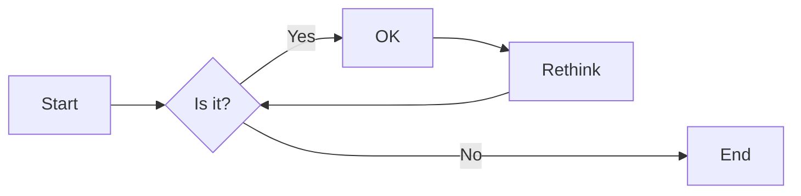
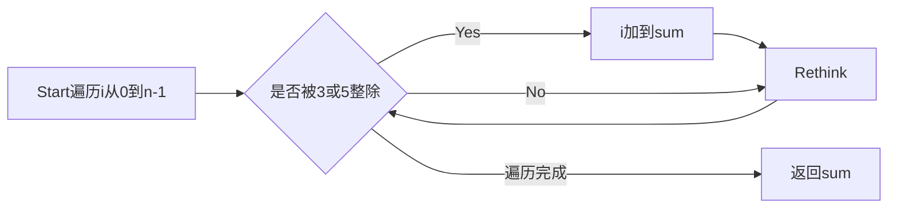

# 实验三 Python列表

班级： 21计科1

学号： 202302200000

姓名： 张三

Github地址：<https://github.com/yourusername/python_course>

CodeWars地址：<https://www.codewars.com/users/yourusername>

---

## 实验目的

1. 学习Python的简单使用和列表操作
2. 学习Python中的if语句

## 实验环境

1. Git
2. Python 3.10
3. VSCode
4. VSCode插件

## 实验内容和步骤

### 第一部分

Python列表操作

完成教材《Python编程从入门到实践》下列章节的练习：

- 第3章 列表简介
- 第4章 操作列表
- 第5章 if语句

---

### 第二部分

在[Codewars网站](https://www.codewars.com)注册账号，完成下列Kata挑战：

---

#### 第一题：3和5的倍数（Multiples of 3 or 5）

难度： 6kyu

如果我们列出所有低于 10 的 3 或 5 倍数的自然数，我们得到 3、5、6 和 9。这些数的总和为 23. 完成一个函数，使其返回小于某个整数的所有是3 或 5 的倍数的数的总和。此外，如果数字为负数，则返回 0。

注意：如果一个数同时是3和5的倍数，应该只被算一次。

**提示：首先使用列表解析得到一个列表，元素全部是3或者5的倍数。
使用sum函数可以获取这个列表所有元素的和.**
range
if% ==0
代码提交地址：
<https://www.codewars.com/kata/514b92a657cdc65150000006>

---

#### 第二题： 重复字符的编码器（Duplicate Encoder）

难度： 6kyu

本练习的目的是将一个字符串转换为一个新的字符串，如果新字符串中的每个字符在原字符串中只出现一次，则为"("，如果该字符在原字符串中出现多次，则为")"。在判断一个字符是否是重复的时候，请忽略大写字母。

例如:

```python
"din"      =>  "((("
"recede"   =>  "()()()"
"Success"  =>  ")())())"
"(( @"     =>  "))(("
```

代码提交地址:
<https://www.codewars.com/kata/54b42f9314d9229fd6000d9c>

---

#### 第三题：括号匹配（Valid Braces）

难度：6kyu

写一个函数，接收一串括号，并确定括号的顺序是否有效。如果字符串是有效的，它应该返回True，如果是无效的，它应该返回False。
例如：

```python
"(){}[]" => True 
"([{}])" => True
 "(}" => False
 "[(])" => False 
"[({})](]" => False
```

**提示：
python中没有内置堆栈数据结构，可以直接使用`list`来作为堆栈，其中`append`方法用于入栈，`pop`方法可以出栈。**

代码提交地址
<https://www.codewars.com/kata/5277c8a221e209d3f6000b56>

---

#### 第四题： 从随机三元组中恢复秘密字符串(Recover a secret string from random triplets)

难度： 4kyu

有一个不为你所知的秘密字符串。给出一个随机三个字母的组合的集合，恢复原来的字符串。

这里的三个字母的组合被定义为三个字母的序列，每个字母在给定的字符串中出现在下一个字母之前。"whi "是字符串 "whatisup "的一个三个字母的组合。

作为一种简化，你可以假设没有一个字母在秘密字符串中出现超过一次。

对于给你的三个字母的组合，除了它们是有效的三个字母的组合以及它们包含足够的信息来推导出原始字符串之外，你可以不做任何假设。特别是，这意味着秘密字符串永远不会包含不出现在给你的三个字母的组合中的字母。

测试用例：

```python
secret = "whatisup"
triplets = [
  ['t','u','p'],
  ['w','h','i'],
  ['t','s','u'],
  ['a','t','s'],
  ['h','a','p'],
  ['t','i','s'],
  ['w','h','s']
]
test.assert_equals(recoverSecret(triplets), secret)
```

代码提交地址：
<https://www.codewars.com/kata/53f40dff5f9d31b813000774/train/python>

提示：

- 利用集合去掉`triplets`中的重复字母，得到字母集合`letters`，最后的`secret`应该由集合中的字母组成，`secret`长度也等于该集合。

```python
letters = {letter for triplet in triplets for letter in triplet }
length = len(letters)
```

- 创建函数`check_first_letter(triplets, first_letter)`，检测一个字母是不是secret的首字母，返回True或者False。
- 创建函数`remove_first_letter(triplets, first_letter)`,  从三元组中去掉首字母，返回新的三元组。
- 遍历字母集合letters，利用上面2个函数得到最后的结果`secret`。

---

#### 第五题： 去掉喷子的元音（Disemvowel Trolls）

难度： 7kyu

喷子正在攻击你的评论区!
处理这种情况的一个常见方法是删除喷子评论中的所有元音(字母：a,e,i,o,u)，以消除威胁。
你的任务是写一个函数，接收一个字符串并返回一个去除所有元音的新字符串。
例如，字符串 "This website is for losers LOL!"   将变成 "Ths wbst s fr lsrs LL!".

注意：对于这个Kata来说，y不被认为是元音。
代码提交地址：
<https://www.codewars.com/kata/52fba66badcd10859f00097e>

提示：

- 首先使用列表解析得到一个列表，列表中所有不是元音的字母。
- 使用字符串的join方法连结列表中所有的字母，例如：

```python
last_name = "lovelace"
letters = [letter for letter in last_name ]
print(letters) # ['l', 'o', 'v', 'e', 'l', 'a', 'c', 'e']
name = ''.join(letters) # name = "lovelace"
```

---

### 第三部分

使用Mermaid绘制程序流程图

安装VSCode插件：

- Markdown Preview Mermaid Support
- Mermaid Markdown Syntax Highlighting

使用Markdown语法绘制你的程序绘制程序流程图（至少一个），Markdown代码如下：


显示效果如下：



查看Mermaid流程图语法-->[点击这里](https://mermaid.js.org/syntax/flowchart.html)

使用Markdown编辑器（例如VScode）编写本次实验的实验报告，包括[实验过程与结果](#实验过程与结果)、[实验考查](#实验考查)和[实验总结](#实验总结)，并将其导出为 **PDF格式** 来提交。

## 实验过程与结果

请将实验过程与结果放在这里，包括：

- [第一部分 Python列表操作和if语句](#第一部分)
- [第二部分 Codewars Kata挑战](#第二部分)

第一题：3和5的倍数

```python
def solution(number):
    return sum(i for i in range(number)
        if i%3 == 0 or i%5 == 0)
```

第二题： 重复字符的编码器

```python
def duplicate_encode(word):
    word = word.lower()
    result_string = ""
    for char in word:
        if word.count(char) > 1:
            result_string += ")"
        else:
            result_string += "("
    return result_string
```

第三题：括号匹配

```python
def valid_braces(string):
    stack = []
    opening_brackets = "({["
    closing_brackets = ")}]"
    for char in string:
        if char in opening_brackets:
            stack.append(char)
        elif char in closing_brackets:
            if not stack:
                return False
            top = stack.pop()
            if opening_brackets.index(top) != closing_brackets.index(char):
                return False
    return len(stack) == 0
```

第四题： 从随机三元组中恢复秘密字符串

```python
def recoverSecret(triplets):
    relations = {}
    for triplet in triplets:
        for char in triplet:
            if char not in relations:
                relations[char] = set()
    
    for triplet in triplets:
        relations[triplet[0]].add(triplet[1])
        relations[triplet[1]].add(triplet[2])
    
    def topological_sort(node, visited, result):
        visited[node] = True
        for neighbor in relations[node]:
            if not visited[neighbor]:
                topological_sort(neighbor, visited, result)
        result.insert(0, node)
    
    result = []
    visited = {char: False for char in relations.keys()}
    
    for char in relations:
        if not visited[char]:
            topological_sort(char, visited, result)
    
    return ''.join(result)
```

第五题： 去掉喷子的元音

```python
def disemvowel(string_):
    vowels = "AEIOUaeiou"
    string_ = ''.join(char for char in string_ if char not in vowels)
    return string_
```

- [第三部分 使用Mermaid绘制程序流程图](#第三部分)

第一题：3和5的倍数



注意代码需要使用markdown的代码块格式化，例如Git命令行语句应该使用下面的格式：


显示效果如下：

```bash
git init
git add .
git status
git commit -m "first commit"
```

如果是Python代码，应该使用下面代码块格式，例如：


显示效果如下：

```python
def add_binary(a,b):
    return bin(a+b)[2:]
```

代码运行结果的文本可以直接粘贴在这里。

**注意：不要使用截图，Markdown文档转换为Pdf格式后，截图可能会无法显示。**

## 实验考查

请使用自己的语言并使用尽量简短代码示例回答下面的问题，这些问题将在实验检查时用于提问和答辩以及实际的操作。

1. Python中的列表可以进行哪些操作？

创建列表,添加元素,插入元素,删除元素,索引访问,修改元素,列表合并,列表复制,列表长度,列表排序,反转列表,列表查找,计数元素,查找元素索引

2. 哪两种方法可以用来对Python的列表排序？这两种方法有和区别？

list.sort() 是一个方法，它会直接修改原始列表，无需创建新的列表，因此在处理大型列表时，它更节省内存和更快速。但要注意，这种排序方法是原地的，不会创建新列表。

sorted() 函数是一个内置函数，它创建一个新的已排序列表，而不会修改原始列表。这意味着原始列表保持不变，因此在需要保留原始数据的情况下很有用。然而，它会占用额外的内存，因为它需要为新列表分配内存。

3. 如何将Python列表逆序打印？

使用reversed()函数或使用切片操作

4. Python中的列表执行哪些操作时效率比较高？哪些操作效率比较差？是否有类似的数据结构可以用来替代列表？

高效操作：索引访问，切片操作，检查元素是否在列表中

低效操作：插入或删除元素，排序

如果需要更高效的插入和删除操作，可以考虑使用双向链表的数据结构，如果需要按值进行高效查找和删除操作，可以考虑使用集合

5. 阅读《Fluent Python》Chapter 2. An Array of Sequence - Tuples Are Not Just Immutable Lists小节（p30-p35）。总结该小节的主要内容。

这一小节深入探讨了元组的特性和用途，以及它们与列表的区别。元组的不可变性、元组解包、命名元组等特性都使它们成为Python中重要的数据结构，适用于多种情境，包括作为字典键、多返回值的函数返回等。


## 实验总结

总结一下这次实验你学习和使用到的知识，例如：编程工具的使用、数据结构、程序语言的语法、算法、编程技巧、编程思想。

字符串操作，包括字符的遍历和处理。使用栈来处理和验证嵌套结构。使用拓扑排序来恢复原始字符串。字符串操作，包括遍历和字符删除。正则表达式的基础知识。
