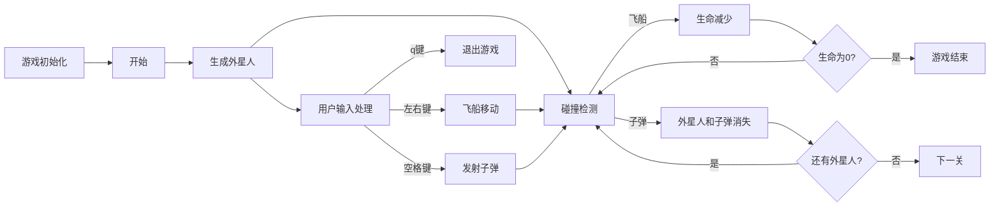
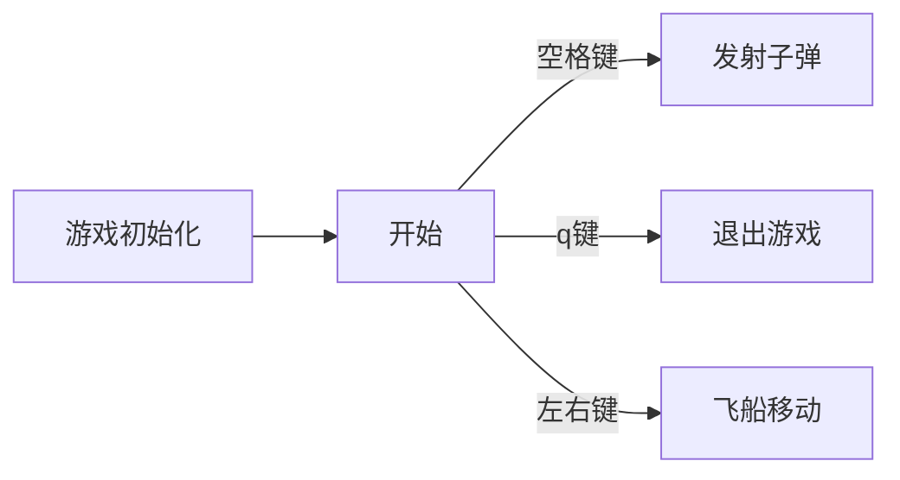
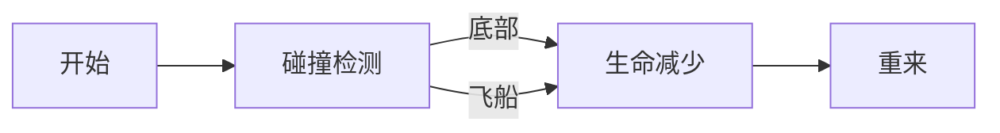
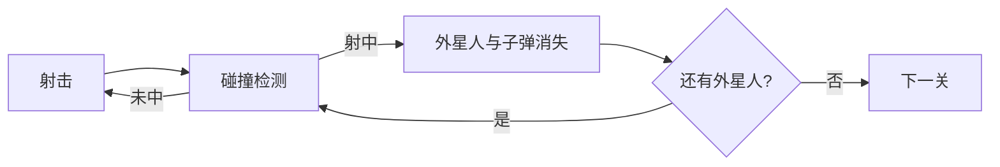

# 《Python程序设计基础》程序设计作品说明书

题目： 你选择的项目题目

学院： 21计科

姓名： 彭浩

学号： B20210302106

指导教师： 周景

起止日期：2023.11.10-2023.12.10

## 摘要

本次项目为基于Python的攻打外星人游戏。点击start按钮开始游戏，玩家可以操控飞船进行左右移动，发射子弹射击下降的外星人，游戏界面包含得分和关卡显示，通过关卡将会逐渐提升游戏难度,同时得分也会增加。玩家有两条命，当生命值为0时，游戏结束。游戏结束后，玩家可以选择重新开始，也可以选择退出游戏。游戏结束后一切重新开始,最高分将被保存在txt文件中。整体设计简洁明了，同时提供了扩展的空间，可以根据需要进一步添加功能和改进游戏体验。

关键词：攻打外星人,关卡显示,提升游戏难度,最高分

## 第1章 需求分析

需要实现功能：

游戏窗口： 提供一个可视化的游戏窗口，包括飞船、外星人、子弹等图像元素，以及得分、关卡显示和start按钮等用户界面组件。

飞船控制： 玩家可以通过键盘控制飞船左右移动，碰到墙壁时飞船无法前进，当飞船撞到外星人时生命减少，当生命值为0时游戏结束。

外星人生成： 实现外星人在游戏窗口中自动生成，左右向下移动，并在飞船与外星人之间进行碰撞检测，当飞船与外星人相撞时，生命减少。

子弹发射： 玩家可以通过按空格使飞船发射子弹，以射击下降的外星人

得分和关卡系统： 提供得分和关卡的显示，随着关卡的通过逐渐提高游戏难度，增加挑战性。

Start按钮和游戏循环： 实现游戏的开始和结束机制，通过Start按钮开始游戏，生命结束后重新开始。

最高分保存： 将玩家的最高得分保存在文件中，为玩家提供挑战和比较的依据。

异常处理： 处理可能出现的异常情况，如文件不存在时的默认处理，以提高系统的稳定性和容错性。

## 第2章 分析与设计

系统架构： 游戏系统采用基于Pygame的单机游戏架构。Pygame提供了一系列模块，涵盖了游戏开发中常见的方面，比如图像处理、音频播放、事件处理、碰撞检测等。开发者可以使用Pygame创建游戏窗口、加载图像和音频文件，处理用户输入，实现游戏逻辑等。

系统流程：

游戏初始化：加载图像、设置窗口、初始化游戏状态和参数。

游戏主循环：处理用户输入、更新游戏状态、绘制图像、进行碰撞检测等。

外星人生成：根据一定规则生成外星人，使其下降移动。

用户输入处理：监听键盘事件，控制飞船移动和发射子弹。

碰撞检测：检测子弹与外星人、飞船与外星人的碰撞。

游戏结束判断：根据玩家得分等条件判断游戏是否结束。

保存最高分：在游戏结束时将最高分保存到文件中。



系统模块：

用户输入处理模块：监听键盘事件，实现飞船的左右移动和子弹的发射。



```python

    def _check_play_button(self, mouse_pos):
        """当玩家点击Play按钮时开始新游戏"""
        button_clicked = self.play_button.rect.collidepoint(mouse_pos)
        if button_clicked and not self.game_active:
            self._start_game()
        def _check_events(self):
        """响应按键和鼠标事件"""
        for event in pygame.event.get():
            if event.type == pygame.QUIT:
                self._close_game()
            elif event.type == pygame.KEYDOWN:
                self._check_keydown_events(event)
            elif event.type == pygame.KEYUP:
                self._check_keyup_events(event)
            elif event.type == pygame.MOUSEBUTTONDOWN:
                mouse_pos = pygame.mouse.get_pos()
                self._check_play_button(mouse_pos)
                
    def _check_keydown_events(self, event):
        """响应按键事件"""
        if event.key == pygame.K_RIGHT:
            self.ship.moving_right = True
        elif event.key == pygame.K_LEFT:
            self.ship.moving_left = True
        elif event.key == pygame.K_q:
            self._close_game()
        elif event.key == pygame.K_SPACE:
            self._fire_bullet()
        elif event.key == pygame.K_p and not self.game_active:
            self._start_game()

    def _check_keyup_events(self, event):
        """响应键盘松开事件"""
        if event.key == pygame.K_RIGHT:
            self.ship.moving_right = False
        elif event.key == pygame.K_LEFT:
            self.ship.moving_left = False
```

生命模块：检测底部与外星人、飞船与外星人之间的碰撞。



```python
    def _ship_hit(self):
        """对飞船被外星人击中进行响应"""
        if self.stats.ships_left > 0:
            #减少剩余飞船数量，并更新计分板
            self.stats.ships_left -= 1
            self.sb.prep_ships()
            
            # 清空所有剩余外星人和子弹
            self.aliens.empty()
            self.bullets.empty()
            
            #创建一个新的舰队并居中飞船
            self._create_fleet()
            self.ship.center_ship()
            
            # Pause.
            sleep(0.5)
        else:
            self.game_active = False
            pygame.mouse.set_visible(True)
    def _check_aliens_bottom(self):
        """检查是否有外星人到达了屏幕底部"""
        screen_rect = self.screen.get_rect()
        for alien in self.aliens.sprites():
            if alien.rect.bottom >= screen_rect.bottom:
                # 将此视作飞船中弹，进行处理
                self._ship_hit()
                break
```

关卡模块：检测攻击与外星人数量。



```python
def _check_bullet_alien_collisions(self):
        """处理子弹与外星人的碰撞"""
        # 移除发生碰撞的子弹和外星人
        collisions = pygame.sprite.groupcollide(
                self.bullets, self.aliens, True, True)

        if collisions:
            for aliens in collisions.values():
                self.stats.score += self.settings.alien_points * len(aliens)
            self.sb.prep_score()
            self.sb.check_high_score()

        if not self.aliens:
            #如果外星人已经全部移除，则销毁现有子弹并创建新的舰队，同时增加游戏速度
            self.bullets.empty()
            self._create_fleet()
            self.settings.increase_speed()

            # 增加关卡数并更新关卡显示
            self.stats.level += 1
            self.sb.prep_level()
```

关键实现：

发射子弹：
算法： 当玩家按下空格键时，创建新的子弹对象，并将其添加到管理所有子弹的 Group 中。使用 Pygame 的 sprite.Group 来管理所有子弹，使得子弹的更新和绘制变得更加方便。

检测碰撞：
算法： 利用 Pygame 提供的 sprite.groupcollide 方法，检测子弹与外星人的碰撞，处理碰撞事件。sprite.groupcollide 方法简化了碰撞检测的实现，当两个 Group 中的 Sprite 相交时，自动触发碰撞。

更新外星人位置：
算法： 在游戏循环中，不断更新外星人的位置，实现它们的移动效果。使用外星人类中的 update 方法来更新外星人的位置，通过控制外星人的速度和方向来实现移动。

创建外星人群：
算法： 在游戏初始化阶段创建外星人群，通过嵌套循环确定每个外星人的位置。使用 Pygame 的 sprite.Group 来管理所有外星人，通过 _create_fleet 方法来创建并添加外星人到 Group。

## 第3章 软件测试

对飞船被外星人击中进行响应

```python
import unittest
import pygame
import sleep

class ShipHitTestCase(unittest.TestCase):
    def setUp(self):
        self.ship = Ship()
        self.stats = Stats()
        self.sb = Scoreboard()
        self.aliens = Aliens()
        self.bullets = Bullets()
        self.game_active = True

    def test_ship_hit_with剩余飞船(self):
        self.stats.ships_left = 3 # 设置剩余飞船数量为3
        self.ship._ship_hit()
        self.assertEqual(self.stats.ships_left, 2) # 检查剩余飞船数量是否减少1
        self.assertTrue(self.sb.is_prepared()) # 检查计分板是否已更新
        self.assertEqual(len(self.aliens), 0) # 检查外星人是否已清空
        self.assertEqual(len(self.bullets), 0) # 检查子弹是否已清空
        self.assertEqual(len(self.ship.fleet), 1) # 检查是否创建了新的舰队
        self.assertTrue(self.ship.is_centered) # 检查飞船是否居中
        self.assertTrue(self.game_active) # 检查游戏是否仍然激活
        sleep.assert_called_once_with(0.5) # 检查是否调用了sleep函数

    def test_ship_hit_without剩余飞船(self):
        self.stats.ships_left = 0 # 设置剩余飞船数量为0
        self.ship._ship_hit()
        self.assertFalse(self.game_active) # 检查游戏是否不再激活
        self.assertEqual(pygame.mouse.get_visible(), True) # 检查鼠标是否可见

if __name__ == '__main__':
    unittest.main()
```

检查是否有外星人到达了屏幕底部

```python
import unittest

class TestCheckAliensBottom(unittest.TestCase):
    def setUp(self):
        # Set up necessary dependencies
        self.screen = Screen()
        self.aliens = Aliens()

    def test_check_alien_bottom(self):
        # Test the _check_aliens_bottom function
        self.screen.rect.bottom = 500
        self.aliens.add_alien(Alien())
        self.aliens.add_alien(Alien())
        self.aliens.add_alien(Alien())
        self.aliens.add_alien(Alien())
        self.aliens.add_alien(Alien())
        self.screen_rect.bottom = 600
        self._check_aliens_bottom()
        # Assert that the _ship_hit() function is called
        # ...

    def tearDown(self):
        # Clean up dependencies
        pass

if __name__ == '__main__':
    unittest.main()
```

检查是否有外星人到达了边缘

```python
import unittest

class TestCheckFleetEdges(unittest.TestCase):
    def setUp(self):
        # Set up necessary test environment
        
    def tearDown(self):
        # Clean up after each test
        
    def test_check_fleet_edges(self):
        # Test the _check_fleet_edges function
        
        # Set up test data
        # Create a fleet object with aliens that are at the edges
        fleet = Fleet()
        alien1 = Alien()
        alien2 = Alien()
        alien1.position = (0, 0)
        alien2.position = (10, 0)
        fleet.add_alien(alien1)
        fleet.add_alien(alien2)
        
        # Call the _check_fleet_edges function
        fleet._check_fleet_edges()
        
        # Check if the fleet direction has been changed
        self.assertEqual(fleet.fleet_direction,反转的方向)
        
        # Clean up test data
        
if __name__ == '__main__':
    unittest.main()
```

响应按键事件

```python
import pygame
import unittest

class TestCheckKeyDownEvents(unittest.TestCase):
    def test_right_key(self):
        # Setup
        event = pygame.event.Event(pygame.KEYDOWN, key=pygame.K_RIGHT)
        ship = Ship()
        game_active = True  # or False, depending on the test case
        # Exercise
        _check_keydown_events(event, ship, game_active)
        # Verify
        self.assertTrue(ship.moving_right)
    
    def test_left_key(self):
        # Setup
        event = pygame.event.Event(pygame.KEYDOWN, key=pygame.K_LEFT)
        ship = Ship()
        game_active = True  # or False, depending on the test case
        # Exercise
        _check_keydown_events(event, ship, game_active)
        # Verify
        self.assertTrue(ship.moving_left)
    
    def test_q_key(self):
        # Setup
        event = pygame.event.Event(pygame.KEYDOWN, key=pygame.K_q)
        ship = Ship()
        game_active = True  # or False, depending on the test case
        # Exercise
        _check_keydown_events(event, ship, game_active)
        # Verify
        self.assertTrue(ship.game_over)  # or any expected outcome related to game_over
    
    def test_space_key(self):
        # Setup
        event = pygame.event.Event(pygame.KEYDOWN, key=pygame.K_SPACE)
        ship = Ship()
        game_active = True  # or False, depending on the test case
        # Exercise
        _check_keydown_events(event, ship, game_active)
        # Verify
        self.assertTrue(ship.bullet_fired)  # or any expected outcome related to bullet_fired
    
    def test_p_key_game_not_active(self):
        # Setup
        event = pygame.event.Event(pygame.KEYDOWN, key=pygame.K_p)
        ship = Ship()
        game_active = False
        # Exercise
        _check_keydown_events(event, ship, game_active)
        # Verify
        self.assertTrue(ship.game_active)  # or any expected outcome related to game_active

if __name__ == '__main__':
    unittest.main()
```

### 单元测试用例

| \#  | 测试目标 | 输入 | 预期结果 | 测试结果 |
| --- | --------- | ----- | ---------------- | ----------------- |
| 1   |对飞船被外星人击中进行响应|飞船被外星人击中|生命减少，重来此关|生命减少，重来此关                   |
| 2   |检查是否有外星人到达了屏幕底部|外星人到达了屏幕底部|生命减少，重来此关|生命减少，重来此关|
| 3   |检查是否有外星人到达了边缘|外星人到达了边缘|外星人改变左右方向                  |外星人改变左右方向                   |
| 4   |响应按键事件|       |对应按键                  |按键对应事件发生                   |按键对应事件发生  

## 结论

本次项目是一个基于Python和Pygame库的外星人入侵游戏开发，通过完成这个小型游戏项目，我获得了许多有关游戏开发和编程的宝贵经验。

首先，项目成功地实现了基本的游戏功能，包括飞船控制、外星人生成、子弹射击、碰撞检测、得分等。这为我提供了一个很好的实践机会，让我更深入地理解了游戏开发中的核心概念和技术。

在项目中，我学到了如何有效地使用Pygame库处理图形和事件，以及如何利用主循环结构实现游戏逻辑。碰撞检测是一个关键的技术，通过Pygame提供的Rect对象的colliderect方法，我成功实现了子弹与外星人、飞船与外星人之间的碰撞检测，使游戏更加真实和有趣。

另外，最高分的保存和读取功能也让我对文件操作有了更深入的了解，这在实际游戏项目中是常见的需求。通过将最高分保存在文件中，游戏为玩家提供了一种长期挑战和竞争的机制。

然而，项目仍然有改进的空间。游戏内容相对简单，可以考虑增加更多的元素和特性，以提升游戏的深度和可玩性。图形和音效方面也可以进一步优化，增强游戏的视觉和听觉体验。此外，更详细的用户提示和规则说明可以帮助新玩家更轻松地上手游戏。

总的来说，这个项目是一个非常有趣和有益的学习经验。通过亲自动手开发游戏，我不仅提高了编程技能，还更深入地理解了游戏开发的方方面面。未来，我期待能够在此基础上继续学习和探索，进一步提升自己的游戏开发能力。这个项目为我打开了游戏开发的大门，让我对这个领域充满了热情和期待。

## 参考文献

1. 基于Python的飞机大战游戏设计 [J] . 瞿苏 . 扬州职业大学学报 . 2019,第1期
2. 基于Python的小鸡快跑游戏设计与实现 [J] . 张健 ,赵丹 ,刘一二 . 电脑编程技巧与维护 . 2022,第7期
3. 基于VR技术的星际大战游戏设计与实现 [J] . 张玉芹 ,龙元明 ,张洋 . 无线互联科技 . 2019,第24期
4. 基于Leap Motion的飞机大战游戏设计与实现 [J] . 单逸飞 ,陈艺婷 ,李懿 . 福建电脑 . 2018,第11期
